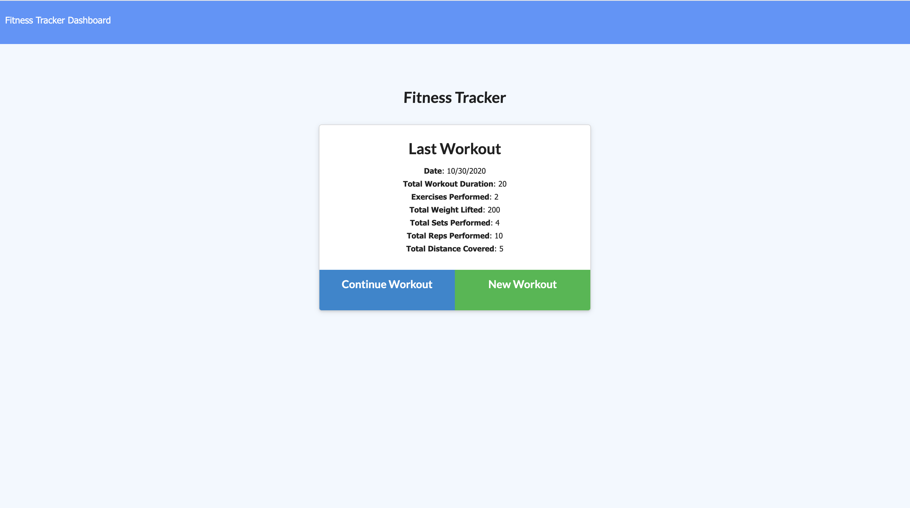
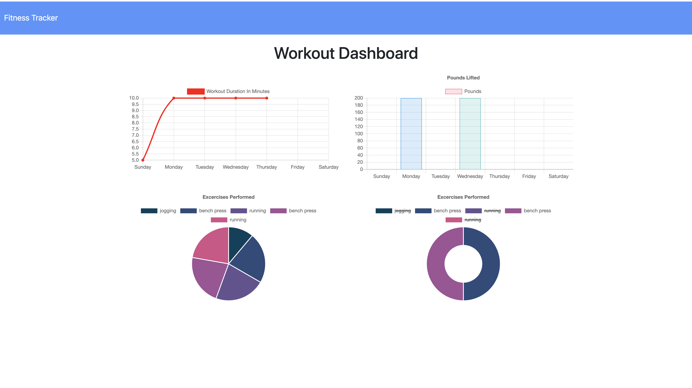

# fitness-tracker

# Description

A consumer will reach their fitness goals more quickly when they track their workout progress.

# Table of Contents
* [Preview](#Preview)
* [Installation](#Installation)
* [Technology](#technology)
* [Features](#Features)
* [Contribution](#contribution)
* [Questions](#Questions)

# Preview

 |HomePage|Dashboard
|--|--
||

# Installation

* Use the package manager npm to install fitness-witness

<pre><code>npm install fitness-tracker</code></pre>

* Run node server.js to start the application.

# Technology

1. MongoDB :

    MongoDB is a general purpose, document-based, distributed database built for modern application developers and for the cloud era.

    MongoDB is a document database, which means it stores data in JSON-like documents.

2. Mongoose :

    MongoDB object modeling for node.js.

    Mongoose provides a straight-forward, schema-based solution to model your application data. It includes built-in type casting, validation, query building, business logic hooks and more.

3. Express.js :

   Web Applications : Express is a minimal and flexible Node.js web application framework that provides a robust set of features for web and mobile applications.

4. Node.js :

   Node.js is an open-source and cross-platform JavaScript runtime environment.

   A Node.js app is run in a single process, without creating a new thread for every request.

# Features
 * Add exercises to a previous workout plan.

  * Add new exercises to a new workout plan.

  * View the combined weight of multiple exercises on the `stats` page.

# Contribution
  Please let me know the improvements of the project.Pull requests and stars are always welcome.
  

# Questions
  * If you have any questions about the repo, here is my repo 
  https://github.com/PratyushaRaghupatruni/fitness-tracker/issues/new
  * You can find  my work at https://github.com/PratyushaRaghupatruni

